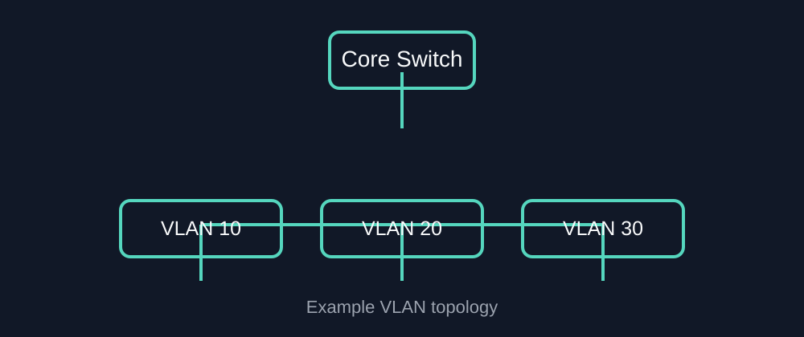

---

title: فهم شبكات VLAN باستخدام مختبر Cisco صغير
date: 2026-09-24
description: مثال عملي باستخدام Markdown يشرح شبكات VLAN ومنافذ Access وTrunk و802.1Q.
tags: [ccna, networking, cisco]
---

# فهم شبكات VLAN باستخدام مختبر Cisco صغير

تسمح لنا شبكات **VLAN** بتقسيم الشبكة المُبدّلة إلى نطاقات بث منطقية، دون الحاجة إلى استخدام سويتش فعلي منفصل لكل شبكة.



## ما هي VLAN؟

الـ **VLAN** هي شبكة منطقية تعمل في الطبقة الثانية **Layer 2**. وعادةً ما تحتاج الأجهزة الموجودة في شبكات VLAN مختلفة إلى جهاز يعمل في الطبقة الثالثة **Layer 3** حتى تتمكن من التواصل مع بعضها.

* VLAN 10 — المستخدمون
* VLAN 20 — الخوادم
* VLAN 30 — الإدارة

## منافذ Access

منفذ **Access** يحمل عادةً حركة المرور الخاصة بشبكة VLAN واحدة. ويكون الإعداد النموذجي كالتالي:

```text
Switch(config)# interface gigabitEthernet 0/1
Switch(config-if)# switchport mode access
Switch(config-if)# switchport access vlan 10
```

## منافذ Trunk و802.1Q

منفذ **Trunk** يحمل حركة المرور الخاصة بعدة شبكات VLAN. ويتم وضع معلومات **802.1Q** داخل إطارات Ethernet حتى يتمكن السويتش المستقبل من معرفة شبكة VLAN التي ينتمي إليها الإطار.

> يتم إرسال الـ Native VLAN بدون وسم 802.1Q على منفذ Trunk الذي يستخدم 802.1Q.

## مرجع سريع

| نوع المنفذ | شبكات VLAN التي يحملها | الاستخدام الشائع     |
| ---------- | ---------------------- | -------------------- |
| Access     | واحدة                  | كمبيوتر، طابعة، خادم |
| Trunk      | متعددة                 | اتصال بين السويتشات  |

## الخلاصة

الفكرة الأساسية بسيطة: **منافذ Access تربط الأجهزة الطرفية، بينما تربط منافذ Trunk أجهزة الشبكة التي تحتاج إلى نقل عدة شبكات VLAN.**
