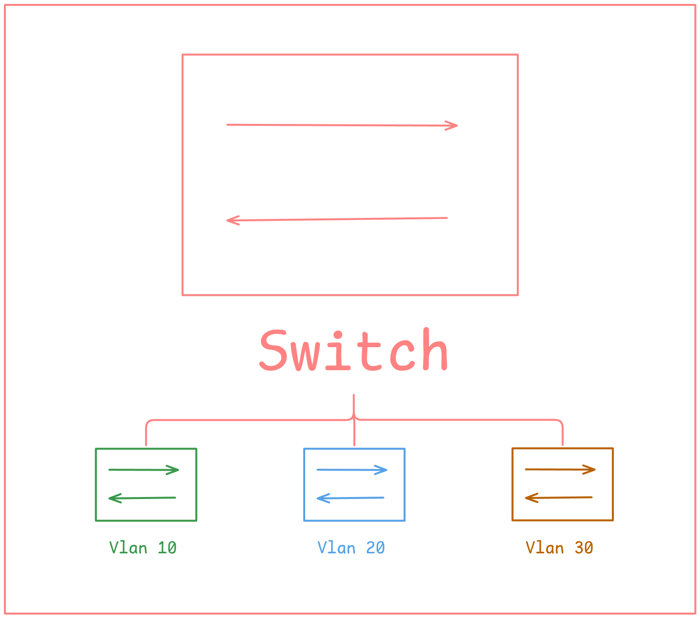

# Understanding VLANs with a Small Cisco Lab

VLANs let us separate a switched network into logical broadcast domains without requiring a separate physical switch for every network.



## What is a VLAN?

A VLAN is a logical Layer 2 network. Devices in different VLANs normally need a Layer 3 device to communicate with each other.

- VLAN 10 — Users
- VLAN 20 — Servers
- VLAN 30 — Management

## Access ports

An **access port** normally carries traffic for one VLAN. A typical configuration looks like this:

```text
Switch(config)# interface gigabitEthernet 0/1
Switch(config-if)# switchport mode access
Switch(config-if)# switchport access vlan 10
```

## Trunk ports and 802.1Q

A **trunk** carries traffic for multiple VLANs. Ethernet frames are tagged with 802.1Q information so the receiving switch knows which VLAN the frame belongs to.

> A native VLAN is sent without an 802.1Q tag on an 802.1Q trunk.

## Quick reference

| Port type | VLANs carried | Common use |
| --- | --- | --- |
| Access | One | PC, printer, server |
| Trunk | Multiple | Switch-to-switch link |

## Summary

The important idea is simple: **access ports connect endpoints, while trunks connect network devices that need to carry multiple VLANs.**
