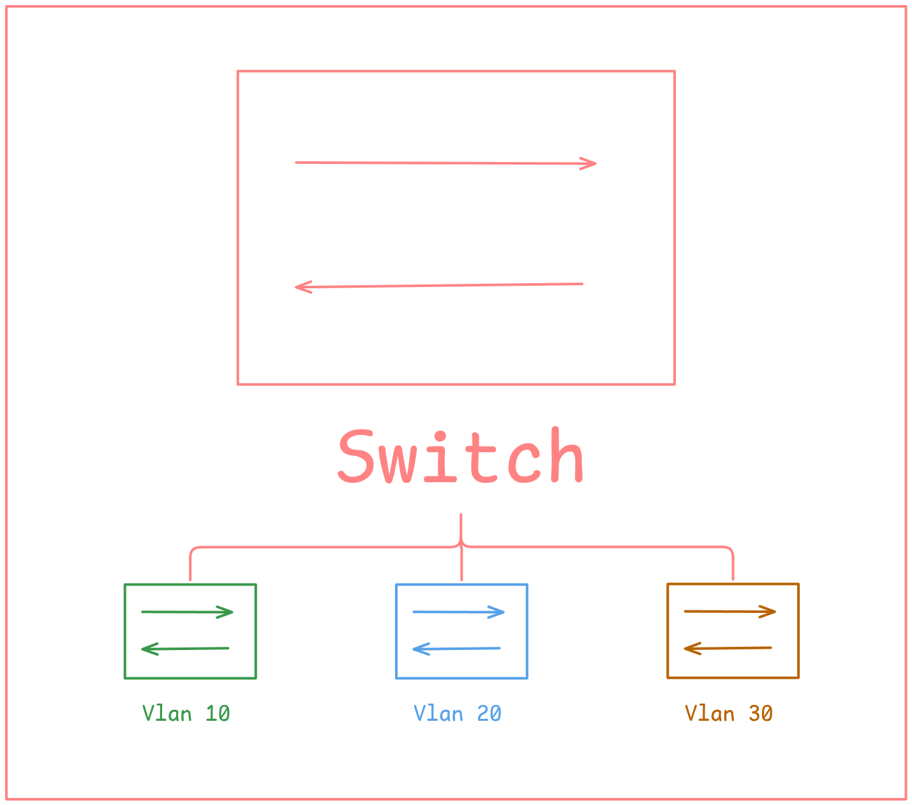

# فهم شبكات VLAN من خلال مختبر Cisco صغير

من الأشياء الأساسية في الشبكات هي الـVLAN، وخصوصًا إذا كنت تتعلم CCNA أو تتعامل مع سويتشات Cisco.

الـVLAN تسمح لنا نقسم الشبكة إلى شبكات منطقية مختلفة بدون الحاجة إلى أن يكون عندنا سويتش مستقل لكل شبكة.



## ما هي VLAN؟

بشكل بسيط، الـVLAN هي شبكة منطقية تعمل في **Layer 2**.

فمثلًا ممكن يكون عندي نفس السويتش، لكن أقسم الأجهزة الموجودة عليه إلى أكثر من شبكة:

* VLAN 10 — المستخدمون
* VLAN 20 — الخوادم
* VLAN 30 — الإدارة

والأجهزة الموجودة في VLAN مختلفة ما تقدر تتواصل مع بعضها مباشرة على Layer 2، وتحتاج إلى جهاز Layer 3 مثل Router أو Layer 3 Switch حتى يتم التوجيه بينها.

## ملاحظة مهمة أثناء إنشاء VLAN

فيه شيء لاحظته أثناء العمل على Cisco IOS، وهو طريقة تعامل السويتش مع أمر إنشاء الـVLAN.

لما تكتب:

```text
Switch(config)# vlan 10
Switch(config-vlan)#
```

أنت هنا دخلت إلى **VLAN Configuration Mode**.

يعني السويتش دخلك إلى وضع إعداد الـVLAN رقم 10، ولسه أنت داخل الـconfiguration context الخاص فيها.

وهنا تقدر مثلًا تغير اسم الـVLAN:

```text
Switch(config)# vlan 10
Switch(config-vlan)# name USERS
```

والشيء الملفت أنه في بعض إصدارات أو بيئات Cisco IOS، إذا حاولت تشوف الـVLAN باستخدام:

```text
Switch(config-vlan)# do show vlan brief
```

قبل الخروج من وضع `config-vlan`، ممكن ما تظهر VLAN 10 في المخرجات.

مثال:

```text
Switch(config)# vlan 10
Switch(config-vlan)# do show vlan brief

VLAN Name                             Status    Ports
---- -------------------------------- --------- -------------------------------
1    default                          active    Et0/0, Et0/1, Et0/2, Et0/3
1002 fddi-default                    act/unsup
1003 token-ring-default              act/unsup
1004 fddinet-default                 act/unsup
1005 trnet-default                   act/unsup

Switch(config-vlan)# exit
Switch(config)# do show vlan brief

VLAN Name                             Status    Ports
---- -------------------------------- --------- -------------------------------
1    default                          active    Et0/0, Et0/1, Et0/2, Et0/3
10   VLAN0010                         active
1002 fddi-default                    act/unsup
1003 token-ring-default              act/unsup
1004 fddinet-default                 act/unsup
1005 trnet-default                   act/unsup
```

وهنا ممكن يجي السؤال:

**هل أمر `exit` هو اللي أنشأ الـVLAN؟**

مو بالضبط.

الأفضل نفهمها على أنها مرتبطة بطريقة Cisco IOS في التعامل مع **configuration modes**.

لما تكتب:

```text
Switch(config)# vlan 10
```

أنت تدخل إلى:

```text
Switch(config-vlan)#
```

ومن هنا تبدأ تعدل خصائص الـVLAN.

وعند كتابة:

```text
Switch(config-vlan)# exit
```

أنت تنهي هذا الـconfiguration context وترجع إلى:

```text
Switch(config)#
```

وبعدها تقدر تشوف الـVLAN ضمن الـVLAN database باستخدام:

```text
show vlan brief
```

يعني `exit` مو أمر إنشاء VLAN بحد ذاته، لكنه ينهي وضع إعداد الـVLAN ويجعل التغيير يظهر بالطريقة المتوقعة في أوامر العرض.

وهذا الموضوع ما ينحصر على إنشاء الـVLAN فقط، حتى تعديل خصائصها مثل الاسم أو غيره يتم من نفس الـconfiguration mode.

## منافذ Access

منفذ **Access** يستخدم عادةً لتوصيل جهاز طرفي مثل كمبيوتر أو طابعة أو سيرفر، ويحمل حركة المرور الخاصة بـVLAN واحدة.

مثلًا:

```text
Switch(config)# interface gigabitEthernet 0/1
Switch(config-if)# switchport mode access
Switch(config-if)# switchport access vlan 10
```

هنا قمنا بجعل المنفذ `Gi0/1` منفذ Access وربطناه مع VLAN 10.

بالتالي أي جهاز متصل بهذا المنفذ يكون ضمن VLAN 10.

## منافذ Trunk

الوضع يختلف مع الـ**Trunk**.

الـTrunk يستخدم عندما نحتاج ننقل أكثر من VLAN من خلال نفس الرابط، مثل الرابط بين سويتش وسويتش آخر.

مثلًا:

```text
Switch(config)# interface gigabitEthernet 0/24
Switch(config-if)# switchport mode trunk
```

بدل ما نحتاج رابط مستقل لكل VLAN، نقدر نستخدم رابط واحد يحمل عدة VLANs.

وهنا يأتي دور **802.1Q**.

## كيف يعرف السويتش الـVLAN الخاصة بالإطار؟

عند مرور أكثر من VLAN على رابط Trunk، يحتاج السويتش يعرف الإطار تابع لأي VLAN.

وهنا يتم استخدام وسم **802.1Q** داخل Ethernet Frame.

بشكل مبسط:

```text
Ethernet Frame
┌──────────┬──────────┬────────────┬──────────┐
│   MAC    │   MAC    │  802.1Q    │ Payload  │
│   DST    │   SRC    │   VLAN ID  │          │
└──────────┴──────────┴────────────┴──────────┘
```

فالـVLAN ID الموجود في الـ802.1Q Tag يساعد السويتش في معرفة الـVLAN التي ينتمي لها الإطار.

### Native VLAN

في الـ802.1Q Trunk يوجد مفهوم اسمه **Native VLAN**.

الإطارات الخاصة بالـNative VLAN يتم إرسالها بشكل **Untagged** بشكل افتراضي، لذلك لازم تكون إعدادات الـNative VLAN متوافقة بين طرفي الـTrunk.

## مرجع سريع

| نوع المنفذ | شبكات VLAN المنقولة | الاستخدام الشائع       |
| ---------- | ------------------- | ---------------------- |
| Access     | VLAN واحدة          | حاسب، طابعة، جهاز طرفي |
| Trunk      | عدة VLANs           | وصلة بين السويتشات     |

## الخلاصة

فكرة الـVLAN بسيطة، لكن التفاصيل تبدأ تظهر لما تدخل في إعدادات السويتش.

الـ**Access Port** يكون عادةً للأجهزة الطرفية ويرتبط بـVLAN واحدة، بينما الـ**Trunk Port** يستخدم لنقل عدة VLANs بين أجهزة الشبكة.

وأثناء إعداد VLAN في Cisco IOS، انتبه للـconfiguration mode اللي أنت موجود فيه، لأن الـprompt نفسه يعطيك فكرة عن المكان اللي أنت تعدل فيه حاليًا:

```text
Switch(config)#
Switch(config-vlan)#
Switch(config-if)#
```

وهذه من الأشياء الصغيرة في Cisco IOS، لكنها مع الوقت تخليك تفهم طريقة عمل الـCLI بشكل أفضل بدل ما تحفظ الأوامر فقط.
