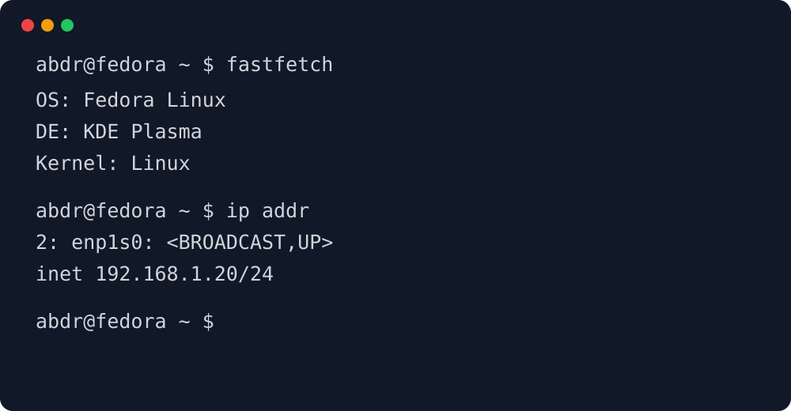

# إعداد الطرفية الخاص بي على Fedora

أستخدم الطرفية بشكل مكثف في مختبرات الشبكات والبرمجة وإدارة الأنظمة.



## سير العمل الأساسي

1. تحديث النظام.
2. تثبيت الأدوات التي أحتاجها.
3. تنظيم ملفات الإعدادات.
4. التحقق من النتيجة من خلال الطرفية.

## أوامر مفيدة

على سبيل المثال، يعرض `fastfetch` معلومات سريعة عن الجهاز، بينما يعرض `ip addr` واجهات الشبكة.

```bash
sudo dnf upgrade
ip addr
ss -tulpn
git status
```

## مثال صغير على Bash

```bash
#!/usr/bin/env bash
set -euo pipefail

echo "اسم المضيف الحالي: $(hostname)"
echo "المستخدم الحالي: $USER"
```

## ملاحظات

تجعل العادات الجيدة في استخدام الطرفية المهام المتكررة أسهل في الأتمتة. كما أفضل وضع الأوامر في سكربتات صغيرة بدلاً من كتابة سلاسل أوامر طويلة بشكل متكرر.
