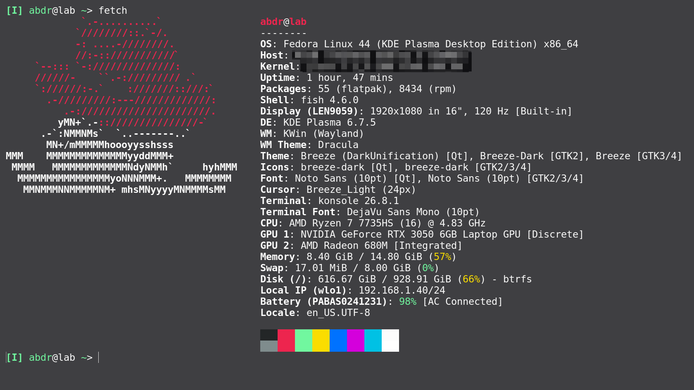

# My Fedora Terminal Setup

I use the terminal heavily for networking labs, programming, and system administration.



## The basic workflow

1. Update the system.
2. Install the tools I need.
3. Keep configuration files organized.
4. Verify the result from the terminal.

## Useful commands

For example, `fastfetch` gives a quick overview of the machine, while `ip addr` shows network interfaces.

```bash
sudo dnf upgrade
ip addr
ss -tulpn
git status
```

## A small Bash example

```bash
#!/usr/bin/env bash
set -euo pipefail

echo "Current hostname: $(hostname)"
echo "Current user: $USER"
```

## Notes

Good shell habits make repetitive tasks easier to automate. I also prefer keeping commands in small scripts instead of repeatedly typing long command sequences.
