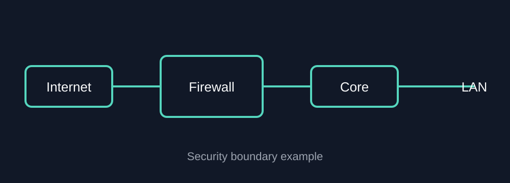

---

title: أين يجب وضع جدار الحماية؟
date: 2026-09-16
description: مثال بسيط على تصميم الشبكات يوضح مخططات الشبكة والاقتباسات البرمجية وأمثلة على الإعدادات.
tags: [firewall, security, networking]
---

# أين يجب وضع جدار الحماية؟

يتم وضع **جدار الحماية (Firewall)** عادةً عند حدود أمنية تفصل بين مناطق مختلفة من حيث مستوى الثقة، بحيث يمكن فحص حركة المرور والتحكم فيها.



## تصميم بسيط

```text
الإنترنت
   |
[ مزود خدمة الإنترنت ISP ]
   |
[ جدار الحماية ]
   |
[ السويتش الأساسي Core Switch ]
   |
+--+-----------+
|              |
المستخدمون    الخوادم
```

## لماذا تعتبر الحدود مهمة؟

يسمح وضع جدار الحماية عند الحدود بتطبيق سياسات أمنية واضحة، مثل:

* تصفية حركة المرور من الإنترنت إلى الشبكة الداخلية
* التحكم في الوصول إلى منطقة الخوادم
* ترجمة عناوين الشبكة (NAT)
* إنهاء اتصالات VPN
* تسجيل حركة المرور وفحصها

## مثال على سياسة أمنية

```text
المصدر: الإنترنت
الوجهة: المستخدمون داخل الشبكة
الإجراء: الرفض افتراضيًا

المصدر: VLAN الإدارة
الوجهة: VLAN الإدارة والتحكم
الإجراء: السماح بحركة مرور الإدارة المعتمدة
```

## مهم

يعتمد الموضع الدقيق لجدار الحماية على تصميم الشبكة. ففي البيئات الكبيرة، قد يتم استخدام عدة جدران حماية أو تقسيم الشبكة إلى مناطق أمنية متعددة بدلًا من الاعتماد على جهاز واحد عند حافة الشبكة.

